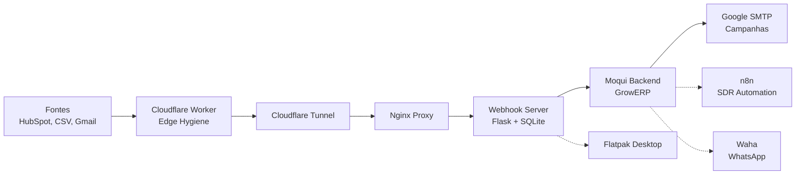

# CRM Pipeline — Status de Implementação

> **Branch**: `integracao`
> **Fork**: `thanermcha/erp-crm` (remote: `fork`)
> **Atualizado**: 2026-06-10

---

## ✅ Concluído (Comitado)

### Infraestrutura Base
| Componente | Commits | Status |
|------------|---------|--------|
| Tenant BLAH_SOFTWARE + seeds | `97416b2`, `6d24b40` | ✅ |
| SimpleByteSource classpath fix | `6d24b40` | ✅ |
| ownerPartyId BLAH_SOFT_OWNER | `6d24b40` | ✅ |
| SSL certs growerp.local.crt/key | manual | ✅ |
| Docker compose stack | `fc4a848` | ✅ |

### Dashboard CRM
| Componente | Commits | Status |
|------------|---------|--------|
| Nginx proxy /crm/ | `fc4a848` | ✅ |
| HTTPS (443 ssl) | `b62bcb2` | ✅ |
| CSS fix #686888 | `b62bcb2` | ✅ |
| Template literals fix | `3e0d93f` | ✅ |

### Documentação
| Arquivo | Descrição |
|---------|-----------|
| `docs/crm-pipeline-overview.md` | Infográfico geral (Mermaid) |
| `docs/crm-pipeline-stages.md` | Detalhamento 8 fases (Mermaid) |
| `docs/crm-implementation-status.md` | Este arquivo |

---

## 🚧 Pipeline CRM (Gerado pelo Python Generator)

### Fase 1 — Backend (SourceRecord + import#Leads)
| Artefato | Status |
|----------|--------|
| `backend/entity/GrowerpEntities.xml` — entidade SourceRecord | ⏳ Gerado |
| `backend/service/growerp/100/ImportExportServices100.xml` — import#Leads | ⏳ Gerado |
| `backend/service/growerp.rest.xml` — REST endpoint leads | ⏳ Gerado |

### Fase 2 — Webhook Server (Flask + SQLite)
| Artefato | Status |
|----------|--------|
| `docker/webhook-server/Dockerfile` | ⏳ Gerado |
| `docker/webhook-server/app.py` | ⏳ Gerado |
| `docker/webhook-server/requirements.txt` | ⏳ Gerado |
| `docker/webhook-server/.env.example` | ⏳ Gerado |
| `docker/docker-compose-override.yaml` — serviço webhook-server | ⏳ Gerado |
| `docker/docker-compose-openclaw.yaml` | ⏳ Gerado |
| `docker/connect-webhook-networks.sh` | ⏳ Gerado |

### Fase 3 — Nginx
| Artefato | Status |
|----------|--------|
| `docker/nginx/crm-dashboard.conf` — locations /webhook/ + /import/ + /health | ⏳ Gerado |

### Fase 4 — Cloudflare Tunnel
| Artefato | Status |
|----------|--------|
| `docker/setup-cloudflare-tunnel.sh` | ⏳ Gerado |
| `docker/cloudflared.service` | ⏳ Gerado |

### Fase 5 — Google SMTP
| Artefato | Status |
|----------|--------|
| `docker/configure-smtp.sh` | ⏳ Gerado |

### Fase 6 — Cloudflare Worker
| Artefato | Status |
|----------|--------|
| `workers/webhook-ingest/wrangler.toml` | ⏳ Gerado |
| `workers/webhook-ingest/src/index.py` | ⏳ Gerado |
| `workers/webhook-ingest/.env.example` | ⏳ Gerado |

### Fase 7 — Gmail API
| Artefato | Status |
|----------|--------|
| `docker/webhook-server/gmail_ingest.py` | ⏳ Gerado |

### Fase 8 — Flatpak
| Artefato | Status |
|----------|--------|
| `flutter/packages/admin/flatpak/blah.crm.yml` | ⏳ Gerado |
| `flutter/packages/admin/flatpak/README.md` | ⏳ Gerado |

---

## ⚙️ Generator

| Script | Descrição |
|--------|-----------|
| `docker/generate-pipeline-files.py` | Gera todas as 8 fases via Python |
| `docker/setup-crm-pipeline.sh` | Wizard interativo (com bug heredoc) |

```bash
# Gerar tudo
python3 docker/generate-pipeline-files.py --all

# Gerar fase específica
python3 docker/generate-pipeline-files.py --phase 2

# Dry-run (mostra o que seria gerado)
python3 docker/generate-pipeline-files.py --dry-run
```

---

## 🔜 Próximos Passos (Pós-finalização)

### Configuração Final CRMs
- [ ] Deploy webhook-server: `docker compose up -d webhook-server`
- [ ] Conectar redes: `bash docker/connect-webhook-networks.sh`
- [ ] Configurar Cloudflare Tunnel
- [ ] App Password Google SMTP
- [ ] Service Account Gmail API
- [ ] Deploy Worker Cloudflare
- [ ] Build Flatpak

### Automação SDR & Marketing
- [ ] Integrar com n8n (meta-agency-stack)
- [ ] Sequências de email automatizadas via Google SMTP
- [ ] Campanhas WhatsApp via waha
- [ ] Pipeline nutrição de leads
- [ ] Relatórios e métricas CRM

---

## Arquitetura Final


