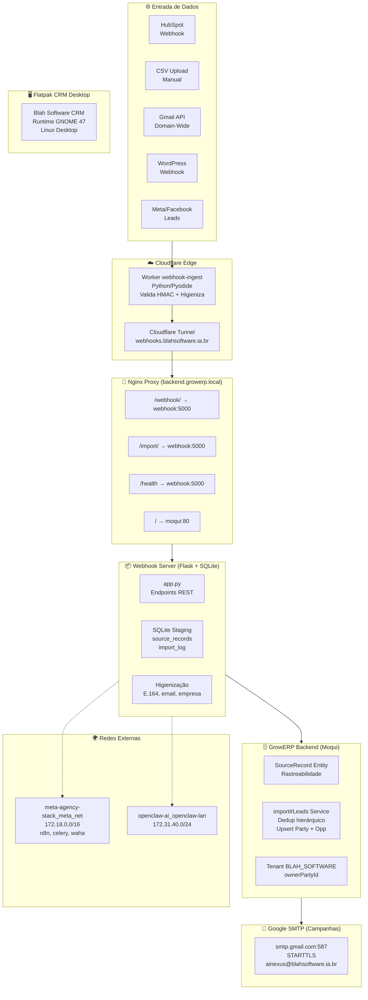
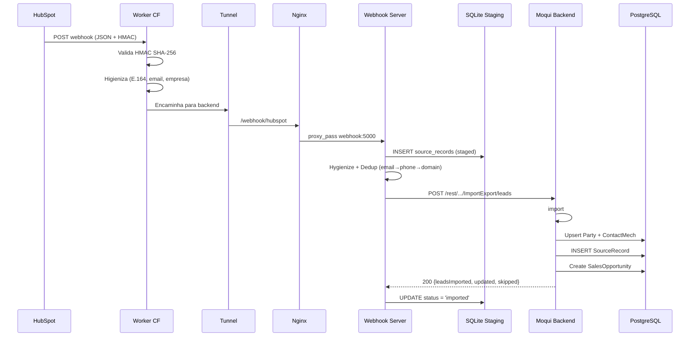
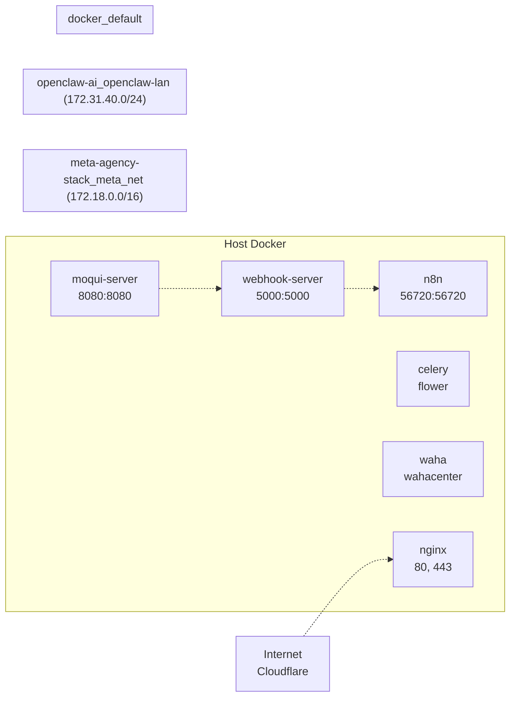
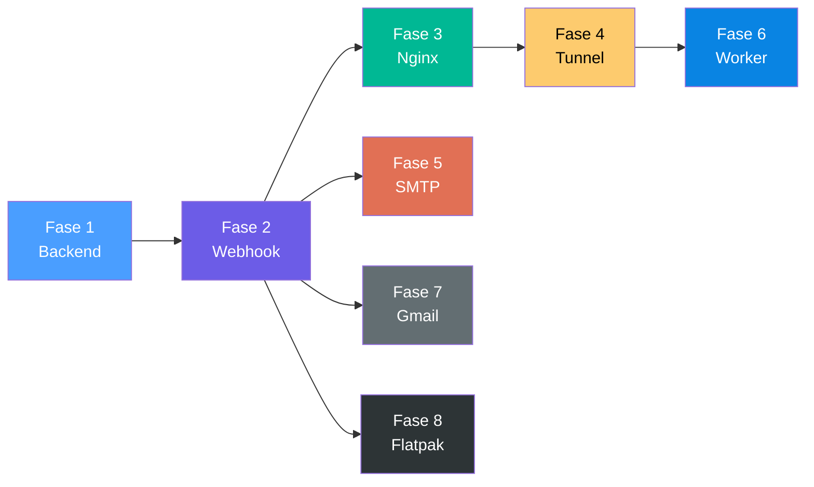

# CRM Pipeline — Visão Geral da Arquitetura



---

## Fluxo de Dados (Pipeline 8 Fases)



---

## Topologia de Rede



---

## Matriz de Endpoints

| Rota | Proxy Para | Finalidade |
|------|-----------|------------|
| `GET /crm/*` | `/opt/crm-dashboard/` | Dashboard estático |
| `POST /webhook/hubspot` | `webhook:5000` | Webhook HubSpot |
| `POST /webhook/csv` | `webhook:5000` | Upload CSV |
| `POST /import/leads` | `webhook:5000` | Proxy leads |
| `POST /import/sync` | `webhook:5000` | Processar fila |
| `GET /health` | `webhook:5000` | Healthcheck |
| `GET /rest/*` | `moqui:80` | API Moqui |
| `POST /rest/.../ImportExport/leads` | `moqui:80` | import#Leads |

---

## Dependências entre Fases



---

## Comandos Rápidos

```bash
# Verificar estado atual
git log --oneline -10

# Gerar todas as fases
python3 docker/generate-pipeline-files.py --all

# Gerar fase específica
python3 docker/generate-pipeline-files.py --phase 2

# Build + start webhook
docker compose -f docker-compose.yaml -f docker-compose-override.yaml up -d webhook-server

# Conectar redes externas
bash docker/connect-webhook-networks.sh

# Ver saúde do pipeline
curl -k https://backend.growerp.local/health

# Ver fila de staging
curl -sk https://backend.growerp.local/staging/status

# Processar fila manualmente
curl -X POST -sk https://backend.growerp.local/import/sync
```
