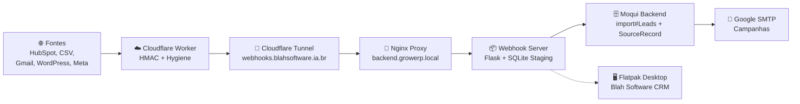

# CRM Pipeline — Detalhamento das 8 Fases

> **Repositório**: `growerp` branch `integracao`
> **Tenant**: BLAH_SOFTWARE (`ownerPartyId: BLAH_SOFT_OWNER`)
> **Domínio interno**: `backend.growerp.local`
> **Domínio público**: `webhooks.blahsoftware.ia.br`
> **SMTP**: `ainexus@blahsoftware.ia.br` via Google Workspace

---

## 🟦 Fase 1 — Backend (SourceRecord + import#Leads)

### O que cria
- **Entidade `SourceRecord`** em `growerp.general` — rastreia cada lead de origem externa
- **Serviço `import#Leads`** — pipeline completo de ingestão com higienização, dedup e upsert
- **REST endpoint** `POST /rest/growerp/100/ImportExport/leads`

### Arquivos alterados
| Arquivo | Mudança |
|---------|---------|
| `backend/entity/GrowerpEntities.xml` | + entidade SourceRecord + seed Enums |
| `backend/service/growerp/100/ImportExportServices100.xml` | + serviço import#Leads |
| `backend/service/growerp.rest.xml` | + resource `leads` |

### Entidade SourceRecord — Campos principais
```
sourceRecordId (PK) | ownerPartyId | sourceEnumId | rawPayload
statusId            | occurrenceCount | sanitizedAt | importedAt
partyId             | errorFlag | lastErrorMessage | lastRawPayload
```

### Enumerations criadas
| Type | Values |
|------|--------|
| `SourceRecordOrigin` | SrcHubSpot, SrcCSV, SrcGmail, SrcWordPress, SrcManual, SrcMeta |
| `SourceRecordStatus` | SrcStaged, SrcHygienized, SrcImported, SrcError, SrcDuplicate |

### Pipeline de higienização (Groovy no serviço)
1. Email → lowercase + trim
2. Phone → E.164 (+55XXXXX)
3. Company → remove LTDA/S.A./ME/EPP/EIRELI
4. Domain → extrai de email ou website
5. Normalização de nome

### Ordem de deduplicação
1. **Email match** → busca `ContactMech` por `infoString`
2. **Phone match** → busca `TelecomNumber` por `contactNumber`
3. **Domain+Company match** → busca `WebAddress` por domínio

### Testes
```bash
# Verificar se entidade carregou
curl -k -u SystemSupport:moqui \
  'https://backend.growerp.local/rest/s1/moqui/basic/Enumeration?enumTypeId=SourceRecordOrigin&pageSize=10'

# Verificar se REST endpoint existe
curl -sk -o /dev/null -w '%{http_code}' \
  -X POST -H 'Content-Type: application/json' \
  -d '{"leads":[]}' \
  'https://backend.growerp.local/rest/s1/growerp/100/ImportExport/leads'
# Esperado: 200 (pode retornar erro de validação, mas não 404)
```

---

## 🟪 Fase 2 — Webhook Server (Flask + SQLite)

### O que cria
- `docker/webhook-server/Dockerfile` — container Python 3.12-slim + gunicorn
- `docker/webhook-server/app.py` — Flask com 6 endpoints
- `docker/webhook-server/requirements.txt` — dependências Python
- `docker/webhook-server/.env.example` — template de variáveis
- `docker/docker-compose-override.yaml` — serviço webhook-server adicionado
- `docker/docker-compose-openclaw.yaml` — conexão com redes externas
- `docker/connect-webhook-networks.sh` — script de conexão

### Endpoints do Flask

| Método | Rota | Função |
|--------|------|--------|
| GET | `/health` | Healthcheck + info SQLite/Moqui |
| POST | `/webhook/hubspot` | Recebe webhook HubSpot, valida HMAC |
| POST | `/webhook/csv` | Upload CSV multipart |
| POST | `/import/leads` | Proxy direto para Moqui |
| POST | `/import/sync` | Processa todos os staged |
| GET | `/staging/status` | Status da fila |

### Estrutura SQLite
```sql
-- Tabela principal
source_records (id, source, owner_party_id, raw_payload, status,
                occurrence_count, sanitized_at, imported_at,
                party_id, error_flag, last_error_message,
                last_raw_payload, created_at, updated_at)

-- Log de importação
import_log (id, source_record_id, batch_size, created,
            updated, skipped, errors, created_at)
```

### Variáveis de ambiente
```
HMAC_SECRET       → Chave secreta HubSpot
GROWERP_API_KEY   → API Key Moqui
OWNER_PARTY_ID    → BLAH_SOFT_OWNER
MOQUI_URL         → http://moqui-server:80
SQLITE_PATH       → /data/source_records.db
LOG_LEVEL         → INFO | DEBUG
```

### Testes
```bash
# Build container
docker compose -f docker-compose.yaml \
  -f docker-compose-override.yaml build webhook-server

# Start
docker compose -f docker-compose.yaml \
  -f docker-compose-override.yaml up -d webhook-server

# Healthcheck
curl http://localhost:5000/health

# Enviar lead de teste
curl -X POST http://localhost:5000/webhook/hubspot \
  -H 'Content-Type: application/json' \
  -d '{"email":"teste@exemplo.com","phone":"11999999999","firstName":"João","lastName":"Silva","company":"Exemplo LTDA"}'

# Ver status
curl http://localhost:5000/staging/status

# Processar fila
curl -X POST http://localhost:5000/import/sync
```

---

## 🟩 Fase 3 — Nginx (/webhook/ + /import/ + /health)

### O que faz
Atualiza `docker/nginx/crm-dashboard.conf` com 3 novos `location` blocks que roteiam para o webhook-server.

### Location blocks adicionados
```nginx
location /webhook/ { proxy_pass http://webhook-server:5000/; }
location /import/  { proxy_pass http://webhook-server:5000/; }
location /health   { proxy_pass http://webhook-server:5000/health; }
```

### Arquivo alterado
`docker/nginx/crm-dashboard.conf` — mesmo arquivo que já serve `/crm/` e `/`.

### Testes
```bash
# Verificar health via nginx
curl -k https://backend.growerp.local/health

# Verificar webhook via nginx
curl -X POST -k https://backend.growerp.local/webhook/hubspot \
  -H 'Content-Type: application/json' \
  -d '{"email":"via-nginx@teste.com"}'

# Verificar import via nginx
curl -X POST -k https://backend.growerp.local/import/sync

# Restart nginx para aplicar mudanças
docker compose -f docker-compose.yaml \
  -f docker-compose-override.yaml restart nginx
```

---

## 🟨 Fase 4 — Cloudflare Tunnel

### O que cria
- `docker/setup-cloudflare-tunnel.sh` — script interativo de setup
- `docker/cloudflared.service` — systemd service para auto-start

### Fluxo de setup
```
1. cloudflared tunnel login          → autentica browser
2. cloudflared tunnel create growerp-backend  → cria tunnel
3. Config ingress: webhooks.blahsoftware.ia.br → nginx:80
4. cloudflared tunnel route dns     → aponta DNS
5. cloudflared tunnel run           → inicia tunnel
```

### Arquivos
| Arquivo | Descrição |
|---------|-----------|
| `docker/setup-cloudflare-tunnel.sh` | Script interativo (755) |
| `docker/cloudflared.service` | Template systemd |

### Comandos
```bash
# Setup completo (interativo)
TUNNEL_NAME=growerp-backend TUNNEL_DOMAIN=webhooks.blahsoftware.ia.br \
  bash docker/setup-cloudflare-tunnel.sh

# Teste após tunnel ativo
curl https://webhooks.blahsoftware.ia.br/health
```

---

## 🟧 Fase 5 — Google SMTP

### O que cria
- `docker/configure-smtp.sh` — script que solicita App Password e atualiza docker-compose

### Configuração
```
SMTP_HOST:     smtp.gmail.com
SMTP_PORT:     587
SMTP_USER:     ainexus@blahsoftware.ia.br
SMTP_PASSWORD: <App Password 16 chars>
STARTTLS:      true
```

### Pré-requisito
Gerar App Password em: https://myaccount.google.com/apppasswords
- App name: `GrowERP CRM`
- Usar o password de 16 caracteres gerado

### Comandos
```bash
# Gerar App Password primeiro (browser)
# Depois:
bash docker/configure-smtp.sh

# Testar envio via Moqui
# Acessar https://backend.growerp.local/vapps → enviar email template
```

---

## 🟦 Fase 6 — Cloudflare Worker (Python/Pyodide)

### O que cria
- `workers/webhook-ingest/wrangler.toml` — configuração do Worker
- `workers/webhook-ingest/src/index.py` — Worker Python com validação HMAC + higienização
- `workers/webhook-ingest/.env.example` — variáveis de ambiente

### Função do Worker
1. Recebe webhook do HubSpot no edge
2. Valida HMAC SHA-256
3. Higieniza dados (E.164, email, empresa)
4. Encaminha para webhook-server via Tunnel

### Arquivos
| Arquivo | Descrição |
|---------|-----------|
| `workers/webhook-ingest/wrangler.toml` | Config Worker CF |
| `workers/webhook-ingest/src/index.py` | Código Python (Pyodide) |
| `workers/webhook-ingest/.env.example` | Template env vars |

### Deploy
```bash
cd workers/webhook-ingest

# Desenvolvimento local
wrangler dev

# Deploy produção
wrangler deploy

# Configurar secrets
wrangler secret put HMAC_SECRET
wrangler secret put BACKEND_URL
wrangler secret put OWNER_PARTY_ID
```

---

## ⬜ Fase 7 — Gmail API (Domain-Wide Delegation)

### O que cria
- `docker/webhook-server/gmail_ingest.py` — script Python que lê emails de TODO o domínio

### Funcionalidades
- Lista TODAS as caixas `@blahsoftware.ia.br` via Directory API
- Lê emails não lidos dos últimos N dias (default: 7)
- Extrai dados de lead do corpo do email
- Converte em SourceRecord com `sourceEnumId = SrcGmail`
- Opção `--push` para enviar ao GrowERP
- Opção `--mailbox user@domain` para mailbox específico

### Pré-requisitos
```bash
# 1. Service Account JSON em:
docker/webhook-server/credentials/google-service-account.json

# 2. Domain-wide delegation no Google Admin Console
#    - Client ID da Service Account
#    - Scopes: gmail.readonly + admin.directory.user.readonly

# 3. .env com:
GOOGLE_SERVICE_ACCOUNT_FILE=/app/credentials/google-service-account.json
DELEGATED_ADMIN=ainexus@blahsoftware.ia.br
GMAIL_DAYS_BACK=7
GMAIL_MAX_MAILBOXES=50
GMAIL_MAX_PER_BOX=20
```

### Comandos
```bash
# Dry-run (apenas log, sem push)
docker exec webhook-server python gmail_ingest.py

# Com push para GrowERP
docker exec webhook-server python gmail_ingest.py --push

# Mailbox específico
docker exec webhook-server python gmail_ingest.py --mailbox contato@blahsoftware.ia.br
```

---

## ⬛ Fase 8 — Flatpak CRM Desktop

### O que cria
- `flutter/packages/admin/flatpak/blah.crm.yml` — manifesto Flatpak
- `flutter/packages/admin/flatpak/README.md` — instruções de build

### Manifest Flatpak (blah.crm.yml)
```
ID:          com.blahsoftware.CRM
Runtime:     org.gnome.Platform//47
SDK:         org.gnome.Sdk//47
Command:     blah-crm
Modules:     flutter-gnu-linux → blah-crm (flutter build linux)
```

### Build (máquina Ubuntu)
```bash
# Instalar Flatpak
sudo apt install flatpak flatpak-builder
flatpak remote-add --user flathub https://flathub.org/repo/flathub.flatpakrepo

# Build
cd flutter/packages/admin
flatpak-builder --user --force-clean \
  build-dir flatpak/blah.crm.yml

# Instalar
flatpak-builder --user --install \
  build-dir flatpak/blah.crm.yml

# Rodar
flatpak run com.blahsoftware.CRM
```

---

## 🔄 Resumo do Pipeline Completo



---

## 🎯 Checkpoints de Verificação

```bash
#!/usr/bin/env bash
# crm-pipeline-check.sh — Verifica status de cada fase
echo "=== CRM Pipeline Status ==="
echo ""

echo "Fase 1 - Backend:"
grep -q "SourceRecord" backend/entity/GrowerpEntities.xml && echo "  ✅ Entity" || echo "  ❌ Entity"
grep -q "import#Leads" backend/service/growerp/100/ImportExportServices100.xml && echo "  ✅ Service" || echo "  ❌ Service"
grep -q "resource name=\"leads\"" backend/service/growerp.rest.xml && echo "  ✅ REST" || echo "  ❌ REST"

echo "Fase 2 - Webhook Server:"
[ -f docker/webhook-server/app.py ] && echo "  ✅ app.py" || echo "  ❌ app.py"
[ -f docker/webhook-server/Dockerfile ] && echo "  ✅ Dockerfile" || echo "  ❌ Dockerfile"
docker ps --format '{{.Names}}' | grep -q webhook-server && echo "  ✅ Container running" || echo "  ❌ Container not running"

echo "Fase 3 - Nginx:"
grep -q "location /webhook/" docker/nginx/crm-dashboard.conf && echo "  ✅ /webhook/" || echo "  ❌ /webhook/"
grep -q "location /import/" docker/nginx/crm-dashboard.conf && echo "  ✅ /import/" || echo "  ❌ /import/"
grep -q "location /health" docker/nginx/crm-dashboard.conf && echo "  ✅ /health" || echo "  ❌ /health"

echo "Fase 4 - Cloudflare Tunnel:"
[ -f docker/setup-cloudflare-tunnel.sh ] && echo "  ✅ Script" || echo "  ❌ Script"
command -v cloudflared &>/dev/null && echo "  ✅ cloudflared installed" || echo "  ❌ cloudflared not installed"

echo "Fase 5 - SMTP:"
[ -f docker/configure-smtp.sh ] && echo "  ✅ Script" || echo "  ❌ Script"
docker inspect moqui-server 2>/dev/null | grep -q "SMTP_HOST" && echo "  ✅ SMTP configured" || echo "  ❌ SMTP not configured"

echo "Fase 6 - Cloudflare Worker:"
[ -f workers/webhook-ingest/wrangler.toml ] && echo "  ✅ wrangler.toml" || echo "  ❌ wrangler.toml"
[ -f workers/webhook-ingest/src/index.py ] && echo "  ✅ index.py" || echo "  ❌ index.py"

echo "Fase 7 - Gmail API:"
[ -f docker/webhook-server/gmail_ingest.py ] && echo "  ✅ gmail_ingest.py" || echo "  ❌ gmail_ingest.py"

echo "Fase 8 - Flatpak:"
[ -f flutter/packages/admin/flatpak/blah.crm.yml ] && echo "  ✅ Manifest" || echo "  ❌ Manifest"

echo ""
echo "=== Fim ==="
```
