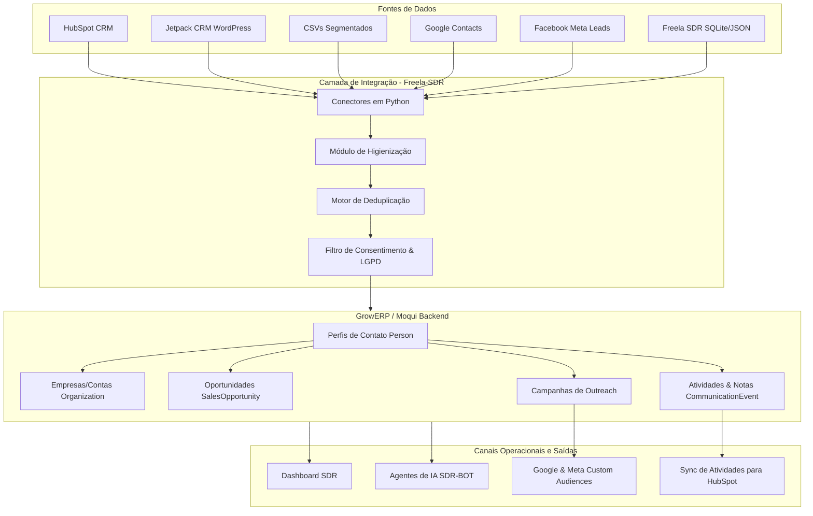

# Integração GrowERP CRM & Freela-SDR (freelabot)
## Guia de Arquitetura e Governança Multi-Contas

Este documento descreve a arquitetura, o fluxo de dados, o mapeamento de entidades e as diretrizes de governança para a integração do **GrowERP** com o ecossistema de agentes autônomos e automação de vendas do **Freela-SDR/freelabot**, hospedado no servidor `chagas`.

---

## 1. Visão Geral da Arquitetura

O **GrowERP** atua como a **camada operacional mestre** (Single Source of Truth - SSOT) para todos os dados comerciais. Todas as fontes de dados externas (HubSpot, WordPress Jetpack CRM, planilhas CSV, Google Contacts, formulários de captura e Meta) são consolidadas em uma camada de Staging e, após limpeza e deduplicação, são persistidas no modelo de dados canônico do GrowERP.

Os agentes de inteligência artificial (SDR-BOT) e os dashboards comerciais realizam operações de leitura e escrita diretamente no GrowERP, mantendo todos os canais de vendas atualizados de forma consistente.



---

## 2. Governança Multi-Contas (Multi-Tenancy por Organização)

Para gerenciar múltiplos clientes comerciais (ex: *M Tratores*, *Blah Software*, *Workana*, *Agro*) de forma isolada sem a sobrecarga de gerenciar múltiplos bancos de dados Moqui, adota-se o modelo de **Isolamento de Dados por Organização (`ownerPartyId`)**.

### Diretrizes de Isolamento:
1.  **Party Hierárquica:** Cada cliente contratante é cadastrado como uma `Organization` independente no GrowERP (tabela `mantle.party.Party` com `partyTypeEnumId='Organization'`).
2.  **Particionamento de Leads:** Todos os contatos (`Person`), oportunidades (`SalesOpportunity`) e atividades (`CommunicationEvent`) gerados devem conter o campo de referência do respectivo cliente dono (`ownerPartyId`).
3.  **Autorização dos Agentes:** Cada script ou agente do freelabot rodando no host `chagas` utiliza uma API Key específica ou conta de serviço vinculada à organização dele, prevenindo vazamento de dados entre clientes.

### Resolução de Conflitos e Prioridade de Fontes (`source_priority`):
Quando um mesmo contato existe em mais de uma fonte, as regras de precedência definem qual dado prevalece no GrowERP:
1.  **Prioridade 1 (Alta):** HubSpot CRM (Dados comerciais validados pelo comercial).
2.  **Prioridade 2 (Média):** WordPress Jetpack CRM (Interações diretas em formulários do site).
3.  **Prioridade 3 (Baixa):** Listas frias de planilhas CSV e bancos locais de scraping.

---

## 3. Mapeamento do Modelo Canônico

O banco de dados SQLite local usado no host `chagas` (`crm_db.py` / `sdr_vault.db`) mapeia suas propriedades diretamente para as entidades nativas do **Moqui/GrowERP**:

| Atributo SQLite (`crm_db.py`) | Entidade GrowERP (Moqui) | Descrição do Mapeamento |
| :--- | :--- | :--- |
| `external_key` | `mantle.party.PartyDataSource` | ID de origem da lead no HubSpot ou Jetpack CRM. |
| `email` | `mantle.party.contact.ContactMech` | Mecanismo de contato com `contactMechTypeId='EmailAddress'`. |
| `name` | `mantle.party.Person` | Separado em `firstName` e `lastName`. |
| `phone` | `mantle.party.contact.TelecomNumber` | Telefone limpo no formato E.164. |
| `company` | `mantle.party.Party` (Organization) | Criado como Organização e vinculado via `PartyRelationship`. |
| `website` | `mantle.party.contact.ContactMech` | URL com `contactMechTypeId='WebAddress'`. |
| `stage` | `mantle.sales.opportunity.SalesOpportunity` | Mapeado em `opportunityStageId` (Ex: `OpLead`, `OpContacted`). |
| `agent_id` | `mantle.party.PartyRelationship` | Identifica o vendedor/representante (`SalesRepresentative`). |
| `tags` | `mantle.party.PartyClassification` | Classificações de segmento (ex: `Agro`, `Peças`, `Quente`). |
| `context_notes` | `mantle.party.PartyNote` | Notas gerais sobre o perfil do contato. |
| `deep_analysis` | `mantle.sales.opportunity.SalesOpportunityNote` | Detalhamento técnico gerado pela IA sobre a oportunidade. |

---

## 4. Pipeline de Ingestão e Deduplicação (Fases de Staging)

O processamento das leads no host `chagas` segue 4 fases obrigatórias antes de persistir as informações no banco de dados do GrowERP:

```
[Fonte de Dados] ──(1) Ingestão──> [Tabela Staging] ──(2) Higienização──> [Deduplicação/Merge] ──(3) Gravação Canônica──> [GrowERP]
```

### Fase 1: Ingestão de Origem (Staging)
Os dados brutos são gravados temporariamente na tabela `source_records` do SQLite local, preservando o JSON original enviado por Webhooks ou CSV. Nenhuma alteração é feita diretamente nas tabelas operacionais nessa etapa.

### Fase 2: Higienização e Normalização
*   **E-mails:** Convertidos para minúsculo, removidos espaços e validados por formato regex.
*   **Telefones:** Formatados no padrão internacional **E.164** (ex: Brasil `+55 (11) 99999-9999` vira `+5511999999999`).
*   **Empresas:** Limpeza de sufixos jurídicos repetitivos (ex: "Ltda", "S/A", "ME") para melhorar a qualidade do agrupamento de contas.
*   **Domínios:** Extração do domínio do site principal com base na URL ou no domínio do e-mail corporativo da lead.

### Fase 3: Deduplicação e Fusão (Merge)
O motor de identidade cruza a lead higienizada utilizando chaves únicas hierárquicas:
1.  **Regra 1:** Match exato de e-mail (`email`).
2.  **Regra 2:** Match exato de telefone no formato E.164 (`contactNumber`).
3.  **Regra 3:** Match de domínio de e-mail corporativo + Nome aproximado da empresa.
*Se houver colisão de dados, o registro existente no GrowERP é atualizado respeitando a precedência de fontes definida na governança.*

### Fase 4: Gravação e Logs
O perfil unificado é enviado para as tabelas principais do GrowERP por meio da API REST. A tabela `source_records` é atualizada com a data de sincronização (`syncDate`) e o `partyId` correspondente gerado no GrowERP.

---

## 5. Rotinas Operacionais

Para manter o CRM funcionando de forma otimizada, o freelabot executará as seguintes rotinas no servidor:

### Diária (Sincronização & Triagem)
*   Execução automática dos conectores do HubSpot e WordPress Jetpack CRM para coletar as leads cadastradas nas últimas 24 horas.
*   Execução do script de normalização e deduplicação.
*   Atualização do funil de oportunidades no Dashboard SDR do GrowERP.

### Antes de Campanhas (Filtros de Qualidade)
*   Geração de segmentos específicos (ex: Tags de nicho como `tratores` ou `Workana`).
*   Validação do status de consentimento/opt-in (filtro LGPD) para campanhas de e-mail e WhatsApp.
*   Exportação de dados hasheados (SHA-256) dos e-mails e telefones dos leads selecionados para alimentar as audiências personalizadas do Meta Ads e Google Ads.

### Semanal (Limpeza & Alinhamento)
*   Geração de relatório de leads duplicados ou sem dados mínimos de contato (telefone/e-mail vazios).
*   Atualização de status de tarefas e follow-ups pendentes dos agentes de IA.

### Mensal (Higienização Geral)
*   Identificação e arquivamento de leads inativas (sem interação há mais de 180 dias).
*   Backup completo dos dados de relacionamento e exportação dos logs de segurança do banco de dados do GrowERP.

---

## 6. Otimizações de Fluxo e Próximos Passos

1.  **Substituir Pooling por Webhooks:**
    Configurar o HubSpot Developer Account e o WordPress (via plugins como *WP Webhooks*) para disparar payloads JSON diretamente para a porta exposta do `crm_core.py` no host `chagas`, eliminando a necessidade de scripts cron de consulta a cada hora.
2.  **Painel de Pré-Visualização do Merge ("Dry-Run"):**
    Criar uma interface simples no dashboard do SDR para exibir sugestões de junção de contatos com score de similaridade (ex: "Mesclar João Silva com Joao da Silva? Confiança: 92%"), permitindo ao operador aprovar ou rejeitar manualmente antes de alterar o banco mestre.
3.  **API Keys Individuais para Agentes:**
    Definir usuários de sistema no Moqui (`UserAccount`) específicos para os bots (ex: `agro_scraper_bot`, `whatsapp_agent_bot`) com permissões estritas para seus escopos de atuação.

## 7. Estratégias Avançadas de Integração

### 7.1 Isolamento por Organização (OwnerPartyId)
O modelo de **Isolamento por Organização** descrito na Seção 2 será aplicado a todos os clientes. Cada registro de lead, contato ou oportunidade deve conter o campo `ownerPartyId` que aponta para a organização (tenant) responsável. Essa abordagem garante que squads de agentes diferentes operem exclusivamente dentro do seu escopo, sem acesso cruzado a dados de outros clientes.

### 7.2 Staging SQL com Histórico de Ocorrências
- **Tabela `source_records`** (PostgreSQL ou SQLite) será estendida com colunas adicionais:
  - `occurrence_count` int — número total de vezes que o mesmo registro foi recebido.
  - `last_raw_payload` jsonb — JSON bruto da última ocorrência.
  - `error_flag` boolean — indica se o registro falhou em alguma regra de validação.
  - `sanitized_at` timestamp — data/hora da última higienização bem‑sucedida.
- Esses campos permitem auditoria completa, rollback de informações sanitizadas e geração de relatórios de qualidade dos dados.

### 7.3 Webhooks WordPress & HubSpot
- **WordPress:** usar o plugin *WP Webhooks* configurado para `POST → http://<host‑chagas>:5000/webhook/wordpress`. O payload inclui campos padrão da Jetpack CRM e um header `X‑HMAC‑SHA256` calculado com segredo compartilhado.
- **HubSpot:** criar subscription webhook (`/webhook/hubspot`) que entrega eventos de `contact.creation`, `contact.propertyChange` e `deal.creation`. Também valida HMAC antes de persistir.
- Ambos os endpoints são implementados em `crm_core.py` e inserem o JSON recebido na tabela `source_records` para posterior processamento.

### 7.4 Squads de Agentes Multiplataforma
Cada squad possui um **manifesto JSON** declarando:
```json
{
  "project_id": "agro_leads",
  "allowed_sources": ["hubspot", "wordpress", "csv"],
  "skills": ["lead_scoring", "sentiment_analysis", "outreach"]
}
```
O orquestrador (`freelabot`) lê esses manifestos e instancia agentes conforme necessidade. Isso permite que um mesmo agente trabalhe simultaneamente em múltiplos projetos, desde que suas API‑Keys estejam associadas ao squad correto.

### 7.5 Extensão para Dispositivos e Plataformas
- **APIs RESTful** já expostas pelo GrowERP são consumidas por SDKs nativos (Kotlin, Swift, React‑Native) para Android, iOS, Windows 10/11 e macOS 10.13.
- **Sincronização Offline:** clientes mantêm um cache SQLite que sincroniza periodicamente via endpoint `/sync`.
- **Deploy de Snapshots:** os *snaps* do GrowERP podem ser exportados como imagens Docker e implantados em servidores externos (AWS, Azure, edge devices), mantendo identidade de API e permitindo expansão para novos hosts.

## 8. Próximos Passos Imediatos
- Implementar a estrutura da tabela `source_records` com os campos de histórico descritos.
- Criar os endpoints webhook (`/webhook/wordpress` e `/webhook/hubspot`) em `crm_core.py`.
- Atualizar os manifestos de squad e gerar scripts de provisionamento de API Keys.
- Documentar o processo de inclusão de novos dispositivos clientes (Android/iOS/desktop) no repositório `growerp/docs`.
- Versionar todas as alterações e incluir testes unitários para garantir consistência entre as plataformas.
